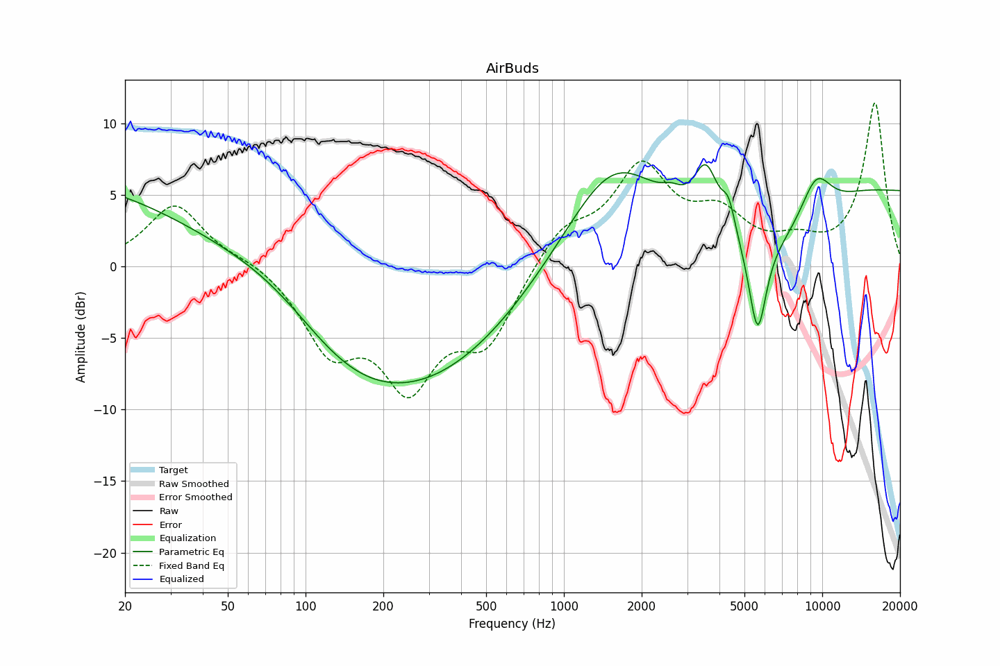

# AirBuds
See [usage instructions](https://github.com/jaakkopasanen/AutoEq#usage) for more options and info.

### Parametric EQs
You can use filters 1-5 or 1-10. Apply preamp of -6.9 dB or -7.1 dB, respectively.

|   # | Type      |   Fc (Hz) |    Q |   Gain (dB) |
|-----|-----------|-----------|------|-------------|
|   1 | LowShelf  |       105 | 0.7  |         2.7 |
|   2 | Peaking   |       155 | 0.29 |        -7   |
|   3 | Peaking   |       366 | 0.48 |        -2.5 |
|   4 | Peaking   |      1577 | 0.69 |         7.6 |
|   5 | Peaking   |      3575 | 2.8  |         4.2 |
|   6 | Peaking   |      2623 | 3.8  |         0.6 |
|   7 | Peaking   |      4372 | 5.51 |         2   |
|   8 | Peaking   |      5625 | 4.18 |        -6.5 |
|   9 | Peaking   |      9379 | 1.87 |         3.7 |
|  10 | HighShelf |     10000 | 0.7  |         5.3 |

### Fixed Band EQs
When using fixed band (also called graphic) equalizer, apply preamp of **-11.7 dB** (if available) and set gains manually with these parameters.

|   # | Type    |   Fc (Hz) |    Q |   Gain (dB) |
|-----|---------|-----------|------|-------------|
|   1 | Peaking |        31 | 1.41 |         0.7 |
|   2 | Peaking |        62 | 1.41 |        -1.9 |
|   3 | Peaking |       125 | 1.41 |        -6   |
|   4 | Peaking |       250 | 1.41 |        -7.3 |
|   5 | Peaking |       500 | 1.41 |        -4.7 |
|   6 | Peaking |      1000 | 1.41 |         2.9 |
|   7 | Peaking |      2000 | 1.41 |         6.5 |
|   8 | Peaking |      4000 | 1.41 |         3   |
|   9 | Peaking |      8000 | 1.41 |         1.5 |
|  10 | Peaking |     16000 | 1.41 |        11.6 |

### Graphs

