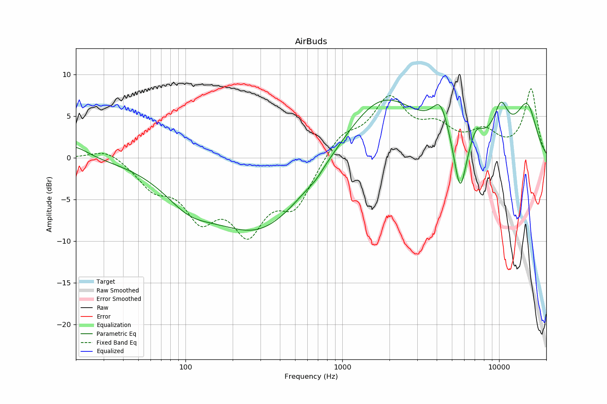

# AirBuds
See [usage instructions](https://github.com/jaakkopasanen/AutoEq#usage) for more options and info.

### Parametric EQs
In case of using parametric equalizer, apply preamp of **-6.4dB** and build filters manually
with these parameters. The first 5 filters can be used independently.
When using independent subset of filters, apply preamp of **-6.9 dB**.

| Type    | Fc       |    Q | Gain    |
|:--------|:---------|:-----|:--------|
| Peaking | 116 Hz   | 0.77 | -3.4 dB |
| Peaking | 373 Hz   | 0.39 | -9.8 dB |
| Peaking | 1617 Hz  | 0.36 | 8.7 dB  |
| Peaking | 5712 Hz  | 3.56 | -8.6 dB |
| Peaking | 13544 Hz | 0.39 | 5.7 dB  |
| Peaking | 19 Hz    | 1.49 | 1.9 dB  |
| Peaking | 1316 Hz  | 2.73 | 2.3 dB  |
| Peaking | 1555 Hz  | 0.72 | -1.1 dB |
| Peaking | 4238 Hz  | 4.33 | 1.8 dB  |
| Peaking | 7447 Hz  | 4.72 | -1.0 dB |

### Fixed Band EQs
In case of using fixed band (also called graphic) equalizer, apply preamp of **-8.6dB**
(if available) and set gains manually with these parameters.

| Type    | Fc       |    Q | Gain    |
|:--------|:---------|:-----|:--------|
| Peaking | 31 Hz    | 1.41 | 1.2 dB  |
| Peaking | 62 Hz    | 1.41 | -3.0 dB |
| Peaking | 125 Hz   | 1.41 | -6.1 dB |
| Peaking | 250 Hz   | 1.41 | -7.7 dB |
| Peaking | 500 Hz   | 1.41 | -5.2 dB |
| Peaking | 1000 Hz  | 1.41 | 2.7 dB  |
| Peaking | 2000 Hz  | 1.41 | 6.6 dB  |
| Peaking | 4000 Hz  | 1.41 | 2.9 dB  |
| Peaking | 8000 Hz  | 1.41 | 2.8 dB  |
| Peaking | 16000 Hz | 1.41 | 8.2 dB  |

### Graphs
