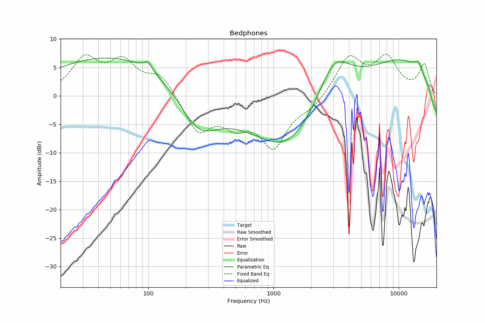

# Bedphones
See [usage instructions](https://github.com/jaakkopasanen/AutoEq#usage) for more options and info.

### Parametric EQs
You can use filters 1-5 or 1-10. Apply preamp of -7.0 dB or -7.0 dB, respectively.

|   # | Type      |   Fc (Hz) |    Q |   Gain (dB) |
|-----|-----------|-----------|------|-------------|
|   1 | LowShelf  |       105 | 0.7  |         6.9 |
|   2 | Peaking   |       292 | 1.33 |        -4.5 |
|   3 | Peaking   |       838 | 0.62 |       -10.3 |
|   4 | Peaking   |      1504 | 1.41 |        -7.7 |
|   5 | Peaking   |      3247 | 0.19 |         7.7 |
|   6 | Peaking   |       104 | 2.42 |         3   |
|   7 | Peaking   |       194 | 2.49 |        -1.2 |
|   8 | Peaking   |      3206 | 4.37 |         1.9 |
|   9 | Peaking   |      4773 | 6    |        -2.7 |
|  10 | HighShelf |     10000 | 0.7  |         1.4 |

### Fixed Band EQs
When using fixed band (also called graphic) equalizer, apply preamp of **-7.2 dB** (if available) and set gains manually with these parameters.

|   # | Type    |   Fc (Hz) |    Q |   Gain (dB) |
|-----|---------|-----------|------|-------------|
|   1 | Peaking |        31 | 1.41 |         6   |
|   2 | Peaking |        62 | 1.41 |         5.6 |
|   3 | Peaking |       125 | 1.41 |         3.6 |
|   4 | Peaking |       250 | 1.41 |        -5.9 |
|   5 | Peaking |       500 | 1.41 |        -4.6 |
|   6 | Peaking |      1000 | 1.41 |        -8   |
|   7 | Peaking |      2000 | 1.41 |        -1.8 |
|   8 | Peaking |      4000 | 1.41 |         6.7 |
|   9 | Peaking |      8000 | 1.41 |         5.5 |
|  10 | Peaking |     16000 | 1.41 |         6.6 |

### Graphs

