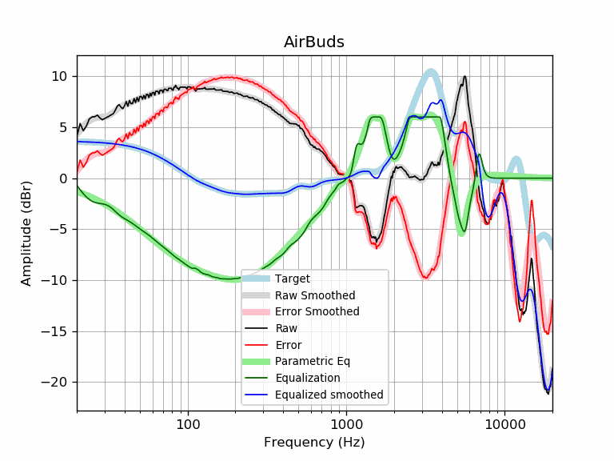

# AirBuds
See [usage instructions](https://github.com/jaakkopasanen/AutoEq#usage) for more options and info.

### Parametric EQs
In case of using parametric equalizer, apply preamp of **-7.0dB** and build filters manually
with these parameters. The first 5 filters can be used independently.
When using independent subset of filters, apply preamp of **-7.0dB**.

| Type    | Fc      |    Q | Gain    |
|:--------|:--------|:-----|:--------|
| Peaking | 95 Hz   | 0.67 | -2.7 dB |
| Peaking | 235 Hz  | 0.48 | -7.1 dB |
| Peaking | 1374 Hz | 1.37 | 5.9 dB  |
| Peaking | 3480 Hz | 1.02 | 6.4 dB  |
| Peaking | 5218 Hz | 3.96 | -7.0 dB |
| Peaking | 19 Hz   | 1.76 | 0.8 dB  |
| Peaking | 5345 Hz | 2.72 | 1.1 dB  |
| Peaking | 5775 Hz | 6.64 | -2.2 dB |
| Peaking | 6789 Hz | 4.74 | 2.8 dB  |
| Peaking | 7623 Hz | 1.54 | -1.4 dB |

### Fixed Band EQs
In case of using fixed band (also called graphic) equalizer, apply preamp of **-7.1dB**
(if available) and set gains manually with these parameters.

| Type    | Fc       |    Q | Gain    |
|:--------|:---------|:-----|:--------|
| Peaking | 31 Hz    | 1.41 | -0.1 dB |
| Peaking | 62 Hz    | 1.41 | -3.0 dB |
| Peaking | 125 Hz   | 1.41 | -6.2 dB |
| Peaking | 250 Hz   | 1.41 | -6.8 dB |
| Peaking | 500 Hz   | 1.41 | -3.8 dB |
| Peaking | 1000 Hz  | 1.41 | 2.8 dB  |
| Peaking | 2000 Hz  | 1.41 | 5.7 dB  |
| Peaking | 4000 Hz  | 1.41 | 3.2 dB  |
| Peaking | 8000 Hz  | 1.41 | -0.9 dB |
| Peaking | 16000 Hz | 1.41 | 0.0 dB  |

### Graphs
