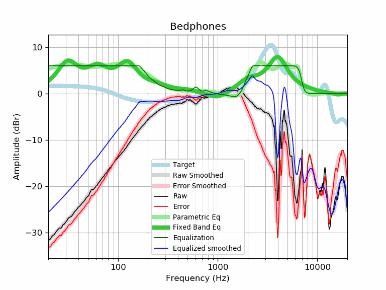

# Bedphones
See [usage instructions](https://github.com/jaakkopasanen/AutoEq#usage) for more options and info.

### Parametric EQs
In case of using parametric equalizer, apply preamp of **-7.6dB** and build filters manually
with these parameters. The first 5 filters can be used independently.
When using independent subset of filters, apply preamp of **-7.5dB**.

| Type    | Fc      |    Q | Gain     |
|:--------|:--------|:-----|:---------|
| Peaking | 85 Hz   | 0.29 | 9.5 dB   |
| Peaking | 270 Hz  | 0.5  | -10.7 dB |
| Peaking | 1524 Hz | 0.72 | -8.8 dB  |
| Peaking | 3152 Hz | 1.21 | 10.2 dB  |
| Peaking | 5851 Hz | 3.51 | 5.0 dB   |
| Peaking | 21 Hz   | 2.69 | 1.9 dB   |
| Peaking | 104 Hz  | 5.48 | 1.4 dB   |
| Peaking | 6740 Hz | 4.45 | 1.8 dB   |
| Peaking | 7523 Hz | 3.36 | -1.7 dB  |
| Peaking | 9656 Hz | 1.44 | -0.4 dB  |

### Fixed Band EQs
In case of using fixed band (also called graphic) equalizer, apply preamp of **-8.4dB**
(if available) and set gains manually with these parameters.

| Type    | Fc       |    Q | Gain    |
|:--------|:---------|:-----|:--------|
| Peaking | 31 Hz    | 1.41 | 5.8 dB  |
| Peaking | 62 Hz    | 1.41 | 5.6 dB  |
| Peaking | 125 Hz   | 1.41 | 3.6 dB  |
| Peaking | 250 Hz   | 1.41 | -5.8 dB |
| Peaking | 500 Hz   | 1.41 | -4.5 dB |
| Peaking | 1000 Hz  | 1.41 | -7.3 dB |
| Peaking | 2000 Hz  | 1.41 | -3.8 dB |
| Peaking | 4000 Hz  | 1.41 | 8.8 dB  |
| Peaking | 8000 Hz  | 1.41 | 0.0 dB  |
| Peaking | 16000 Hz | 1.41 | -0.3 dB |

### Graphs
