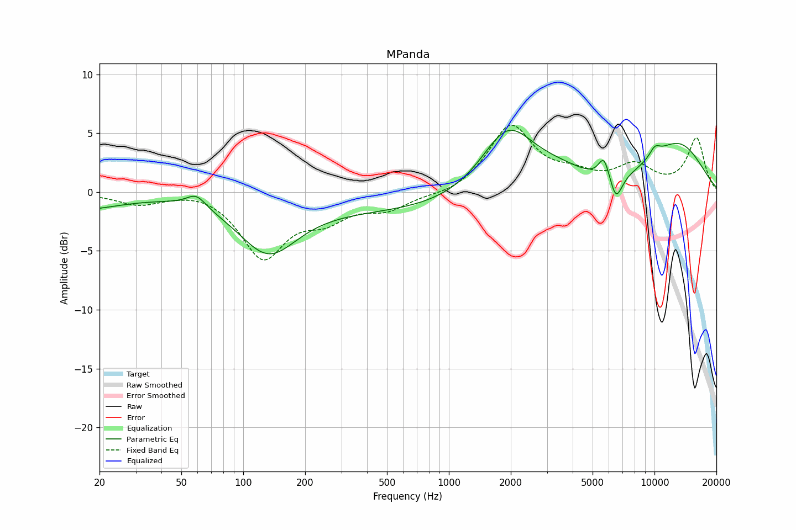

# MPanda
See [usage instructions](https://github.com/jaakkopasanen/AutoEq#usage) for more options and info.

### Parametric EQs
In case of using parametric equalizer, apply preamp of **-5.4dB** and build filters manually
with these parameters. The first 5 filters can be used independently.
When using independent subset of filters, apply preamp of **-5.4 dB**.

| Type    | Fc       |    Q | Gain    |
|:--------|:---------|:-----|:--------|
| Peaking | 132 Hz   | 0.98 | -4.7 dB |
| Peaking | 1830 Hz  | 0.11 | -1.8 dB |
| Peaking | 1933 Hz  | 1.05 | 6.0 dB  |
| Peaking | 3511 Hz  | 0.85 | 1.9 dB  |
| Peaking | 12609 Hz | 0.6  | 4.8 dB  |
| Peaking | 16 Hz    | 0.74 | -1.3 dB |
| Peaking | 59 Hz    | 3.01 | 1.1 dB  |
| Peaking | 5683 Hz  | 5.08 | 1.9 dB  |
| Peaking | 6500 Hz  | 4.39 | -2.2 dB |
| Peaking | 10040 Hz | 4.41 | 0.8 dB  |

### Fixed Band EQs
In case of using fixed band (also called graphic) equalizer, apply preamp of **-5.9dB**
(if available) and set gains manually with these parameters.

| Type    | Fc       |    Q | Gain    |
|:--------|:---------|:-----|:--------|
| Peaking | 31 Hz    | 1.41 | -1.0 dB |
| Peaking | 62 Hz    | 1.41 | 0.4 dB  |
| Peaking | 125 Hz   | 1.41 | -5.4 dB |
| Peaking | 250 Hz   | 1.41 | -1.9 dB |
| Peaking | 500 Hz   | 1.41 | -1.3 dB |
| Peaking | 1000 Hz  | 1.41 | -0.4 dB |
| Peaking | 2000 Hz  | 1.41 | 5.6 dB  |
| Peaking | 4000 Hz  | 1.41 | 1.1 dB  |
| Peaking | 8000 Hz  | 1.41 | 2.0 dB  |
| Peaking | 16000 Hz | 1.41 | 4.5 dB  |

### Graphs
